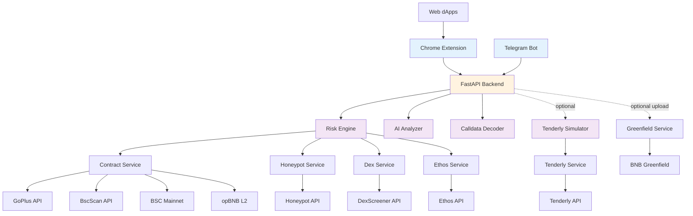
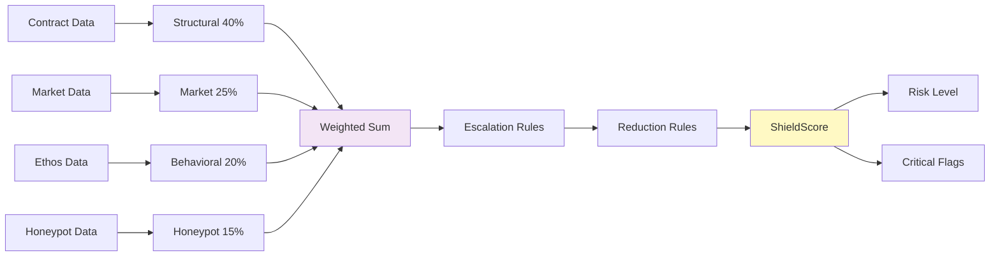
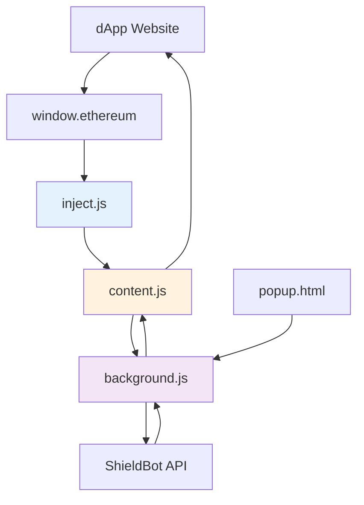
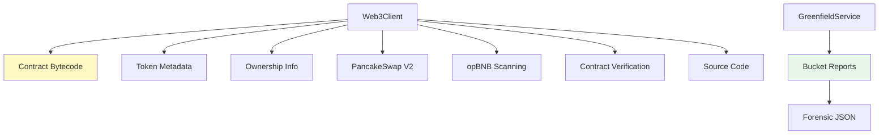
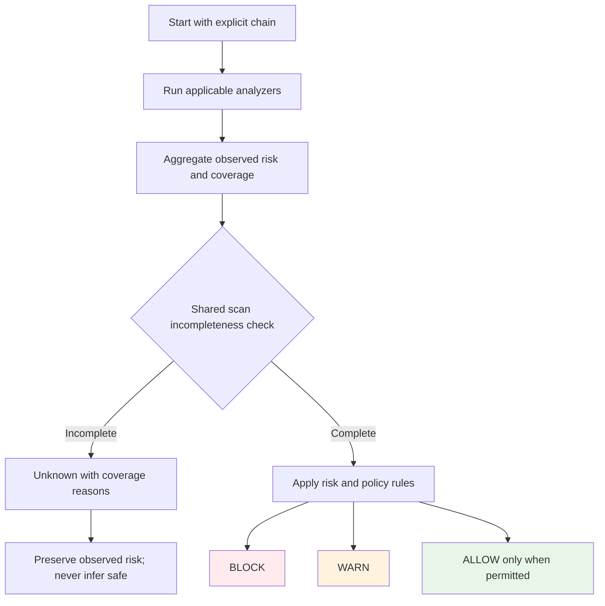

# ShieldBot - Architecture Diagram

These are simplified February 2026 illustrations of the BNB Smart Chain and opBNB path, not evidence that every provider is available. The current chain list is in [the README](../README.md); the extension's shipped-chain limitation and current source-tree coverage contract are described in [TECHNICAL.md](TECHNICAL.md).

## System Architecture

```mermaid
flowchart TB
    A[Chrome Extension] --> D[FastAPI Backend]
    B[Telegram Bot] --> D
    C[Web dApps] --> A

    D --> E[Risk Engine]
    D --> F[AI Analyzer]
    D --> G[Calldata Decoder]
    D -. optional .-> H[Tenderly Simulator]

    E --> I1[Contract Service]
    E --> I2[Honeypot Service]
    E --> I3[Dex Service]
    E --> I4[Ethos Service]
    H --> I5[Tenderly Service]
    D -. optional upload .-> I6[Greenfield Service]

    I1 --> K1[GoPlus API]
    I1 --> K6[BscScan API]
    I2 --> K2[Honeypot API]
    I3 --> K3[DexScreener API]
    I4 --> K4[Ethos API]
    I5 --> K5[Tenderly API]
    I6 --> J3[BNB Greenfield]

    I1 --> J1[BSC Mainnet]
    I1 --> J2[opBNB L2]

    style A fill:#e3f2fd
    style B fill:#e3f2fd
    style D fill:#fff3e0
    style E fill:#f3e5f5
    style F fill:#f3e5f5
    style G fill:#f3e5f5
    style H fill:#f3e5f5
```

## Transaction Flow

Simplified historical BNB Smart Chain path. Optional services can be disabled or fail. Greenfield creates an object record on-chain and stores report bytes with a storage provider; it is separate from the Robinhood verdict registry.

```mermaid
sequenceDiagram
    participant User
    participant dApp
    participant Extension
    participant API
    participant RiskEngine
    participant Services
    participant BSC
    participant Greenfield

    User->>dApp: Initiate Token Swap
    dApp->>Extension: eth_sendTransaction
    Extension->>API: POST /api/firewall

    par Parallel Data Gathering
        API->>Services: ContractService.fetch_contract_data()
        API->>Services: HoneypotService.fetch_honeypot_data()
        API->>Services: DexService.fetch_token_market_data()
        API->>Services: EthosService.fetch_wallet_reputation()
        API->>Services: TenderlySimulator.simulate_transaction() if enabled
    end

    Services->>BSC: eth_getCode, eth_call
    BSC-->>Services: Contract Data
    Services-->>API: Aggregated Data

    API->>RiskEngine: compute_composite_risk()
    RiskEngine-->>API: ShieldScore + Verdict

    alt High Risk (Score >= 71)
        opt Greenfield enabled (upload threshold is risk >= 50)
            API->>Greenfield: Attempt report upload
            Greenfield-->>API: URL on success, otherwise absent
        end
        API-->>Extension: BLOCK recommendation + optional URL
        Extension->>User: Red risk warning (cancel/proceed)
    else Medium Risk (31-70)
        API-->>Extension: WARN
        Extension->>User: 🟡 ORANGE OVERLAY (Proceed/Cancel)
        User->>Extension: User Decision
    else Incomplete coverage
        API-->>Extension: Unknown with coverage reasons
        Extension->>User: Incomplete analysis; no safety decision
    else Low Risk (0-30), complete required coverage
        API-->>Extension: ALLOW
        Extension->>dApp: Forward Transaction
        dApp->>User: MetaMask Signature Request
    end
```

## Data Flow (Composite Risk Scoring)

```mermaid
flowchart LR
    A1[Contract Data] --> B1[Structural 40%]
    A2[Honeypot Data] --> B4[Honeypot 15%]
    A3[Market Data] --> B2[Market 25%]
    A4[Ethos Data] --> B3[Behavioral 20%]

    B1 --> C[Weighted Sum]
    B2 --> C
    B3 --> C
    B4 --> C

    C --> D[Escalation Rules]
    D --> E[Reduction Rules]
    E --> F[ShieldScore]
    F --> G[Risk Level]
    F --> H[Critical Flags]

    style C fill:#f3e5f5
    style F fill:#fff9c4
```

## Chrome Extension Architecture

```mermaid
flowchart TB
    A[dApp Website] --> B[window.ethereum]
    B --> C[inject.js]
    C --> D[content.js]
    D --> E[background.js]
    E --> G[ShieldBot API]
    G --> E
    E --> D
    D --> A
    F[popup.html] --> E

    style C fill:#e3f2fd
    style D fill:#fff3e0
    style E fill:#f3e5f5
```

## BNB Chain Integration Points

```mermaid
flowchart TB
    A[Web3Client] --> C[Contract Bytecode]
    A --> D[Token Metadata]
    A --> E[Ownership Info]
    A --> F[PancakeSwap V2]
    A --> G[opBNB Scanning]
    A --> J[Contract Verification]
    A --> K[Source Code]

    B[GreenfieldService] --> H[Bucket Reports]
    H --> I[Forensic JSON]

    style C fill:#fff9c4
    style H fill:#e8f5e9
```

## Risk Scoring Algorithm

```mermaid
flowchart TD
    A[Start with explicit chain] --> B[Run applicable analyzers]
    B --> C[Aggregate observed risk and coverage]
    C --> D{Shared scan incompleteness check}
    D -->|Incomplete| E[Unknown with coverage reasons]
    E --> F[Preserve observed risk; never infer safe]
    D -->|Complete| G[Apply risk and policy rules]
    G --> S[BLOCK]
    G --> U[WARN]
    G --> V[ALLOW only when permitted]

    style S fill:#ffebee
    style U fill:#fff3e0
    style V fill:#e8f5e9
```

---

**Note:** These diagrams are rendered automatically on GitHub. You can also use [Mermaid Live Editor](https://mermaid.live/) to view/edit them.
