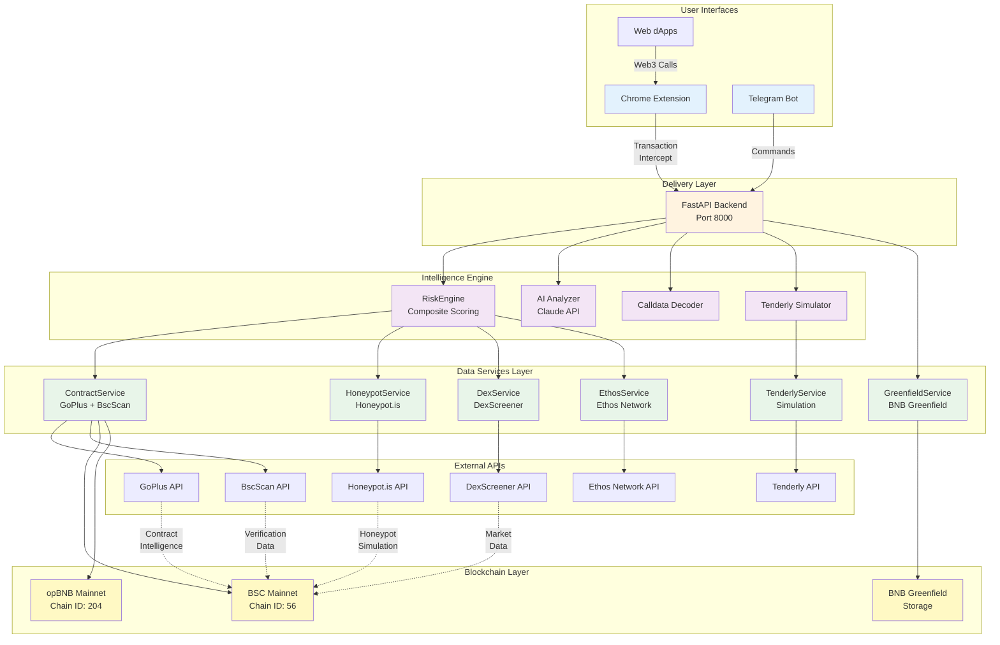
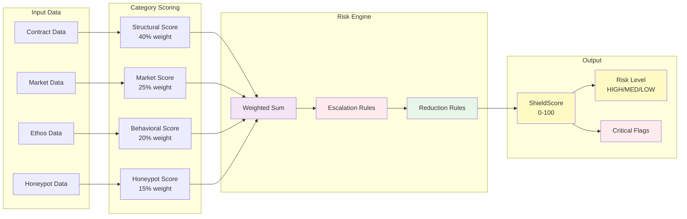
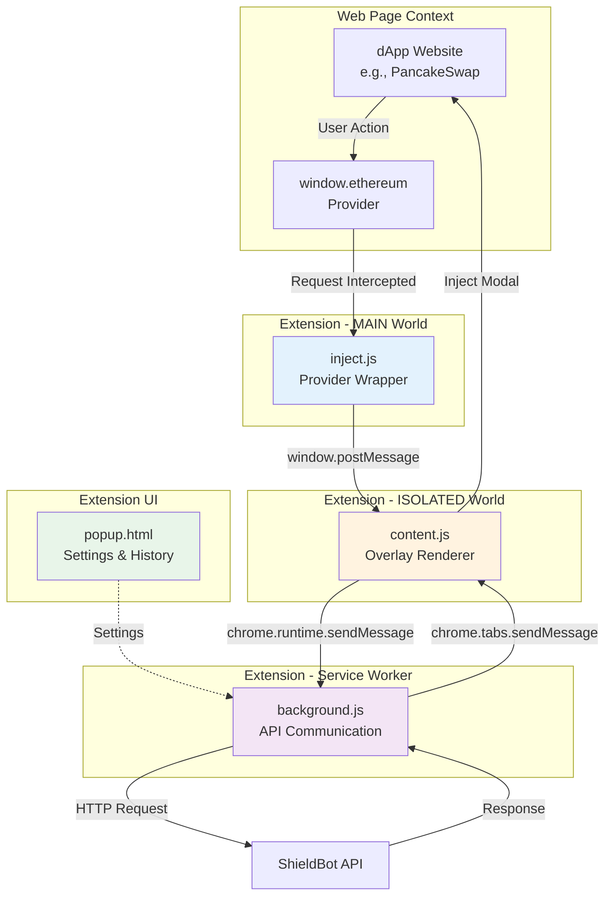
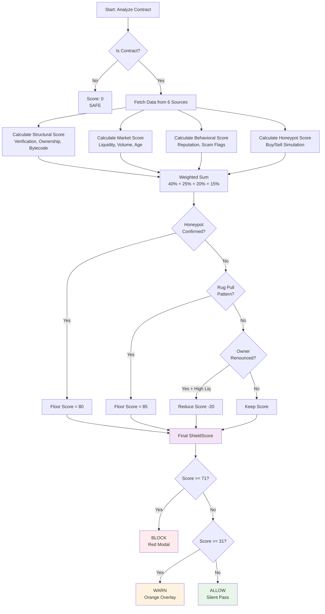

# ShieldBot - Architecture Diagram

## System Architecture



## Transaction Flow

```mermaid
sequenceDiagram
    participant User
    participant dApp
    participant Extension
    participant API
    participant RiskEngine
    participant Services
    participant BSC
    participant Greenfield

    User->>dApp: Initiate Token Swap
    dApp->>Extension: eth_sendTransaction
    Extension->>API: POST /api/firewall

    par Parallel Data Gathering
        API->>Services: ContractService.fetch()
        API->>Services: HoneypotService.fetch()
        API->>Services: DexService.fetch()
        API->>Services: EthosService.fetch()
        API->>Services: TenderlyService.simulate()
    end

    Services->>BSC: eth_getCode, eth_call
    BSC-->>Services: Contract Data
    Services-->>API: Aggregated Data

    API->>RiskEngine: compute_composite_risk()
    RiskEngine-->>API: ShieldScore + Verdict

    alt High Risk (Score >= 71)
        API->>Greenfield: Upload Forensic Report
        Greenfield-->>API: Report URL
        API-->>Extension: BLOCK + Report URL
        Extension->>User: 🔴 RED MODAL (Blocked)
    else Medium Risk (31-70)
        API-->>Extension: WARN
        Extension->>User: 🟡 ORANGE OVERLAY (Proceed/Cancel)
        User->>Extension: User Decision
    else Low Risk (0-30)
        API-->>Extension: ALLOW
        Extension->>dApp: Forward Transaction
        dApp->>User: MetaMask Signature Request
    end
```



## Data Flow (Composite Risk Scoring)



## Chrome Extension Architecture



## BNB Chain Integration Points

```mermaid
graph TB
    subgraph "ShieldBot Backend"
        A[Web3Client]
        B[GreenfieldService]
    end

    subgraph "BSC Mainnet"
        C[Contract Bytecode<br/>eth_getCode]
        D[Token Metadata<br/>name, symbol, decimals]
        E[Ownership Info<br/>owner()]
        F[PancakeSwap V2<br/>getPair, balanceOf]
    end

    subgraph "opBNB L2"
        G[Contract Scanning<br/>Chain ID: 204]
    end

    subgraph "BNB Greenfield"
        H[Bucket: shieldbot-reports]
        I[Forensic Reports<br/>JSON Objects]
    end

    subgraph "BscScan API"
        J[Contract Verification]
        K[Source Code]
        L[Creation Info]
    end

    A --> C
    A --> D
    A --> E
    A --> F
    A --> G
    A --> J
    A --> K
    A --> L

    B --> H
    H --> I

    style C fill:#fff9c4
    style D fill:#fff9c4
    style E fill:#fff9c4
    style F fill:#fff9c4
    style G fill:#fff9c4
    style H fill:#e8f5e9
    style I fill:#e8f5e9
```

## Risk Scoring Algorithm



---

**Note:** These diagrams are rendered automatically on GitHub. You can also use [Mermaid Live Editor](https://mermaid.live/) to view/edit them.
