# ShieldBot - Architecture Diagram

## System Architecture

## Transaction Flow

```mermaid
sequenceDiagram
    participant User
    participant dApp
    participant Extension
    participant API
    participant RiskEngine
    participant Services
    participant BSC
    participant Greenfield

    User->>dApp: Initiate Token Swap
    dApp->>Extension: eth_sendTransaction
    Extension->>API: POST /api/firewall

    par Parallel Data Gathering
        API->>Services: ContractService.fetch()
        API->>Services: HoneypotService.fetch()
        API->>Services: DexService.fetch()
        API->>Services: EthosService.fetch()
        API->>Services: TenderlyService.simulate()
    end

    Services->>BSC: eth_getCode, eth_call
    BSC-->>Services: Contract Data
    Services-->>API: Aggregated Data

    API->>RiskEngine: compute_composite_risk()
    RiskEngine-->>API: ShieldScore + Verdict

    alt High Risk (Score >= 71)
        API->>Greenfield: Upload Forensic Report
        Greenfield-->>API: Report URL
        API-->>Extension: BLOCK + Report URL
        Extension->>User: 🔴 RED MODAL (Blocked)
    else Medium Risk (31-70)
        API-->>Extension: WARN
        Extension->>User: 🟡 ORANGE OVERLAY (Proceed/Cancel)
        User->>Extension: User Decision
    else Low Risk (0-30)
        API-->>Extension: ALLOW
        Extension->>dApp: Forward Transaction
        dApp->>User: MetaMask Signature Request
    end
```

## Data Flow (Composite Risk Scoring)

## Chrome Extension Architecture

## BNB Chain Integration Points

## Risk Scoring Algorithm

---

**Note:** These diagrams are rendered automatically on GitHub. You can also use [Mermaid Live Editor](https://mermaid.live/) to view/edit them.
